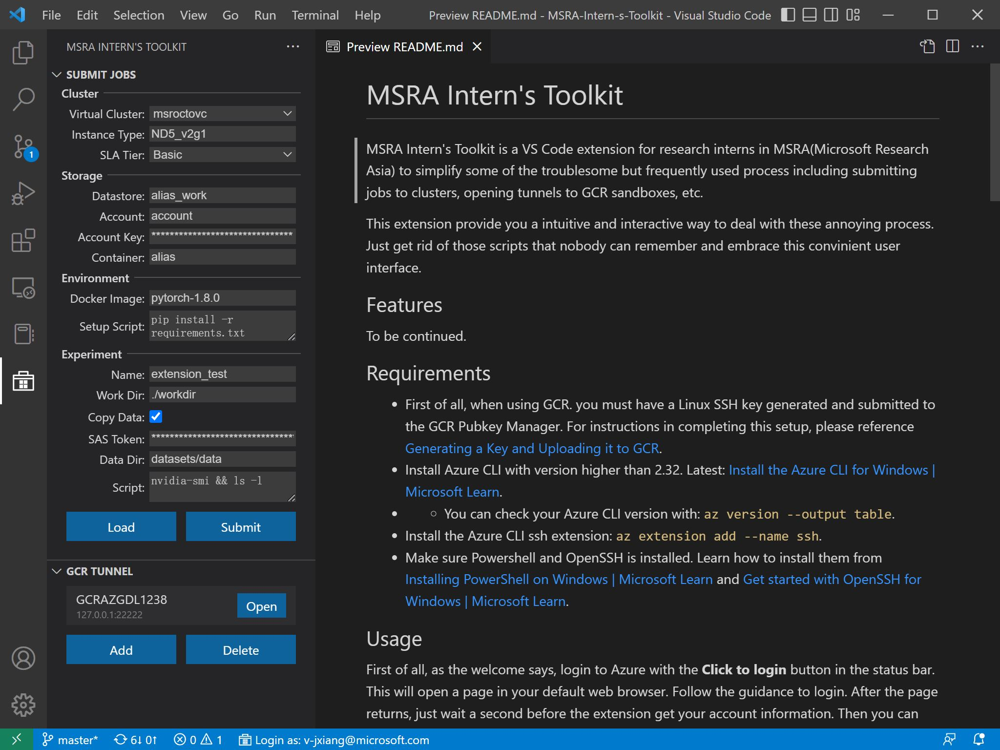

# MSRA Intern's Toolkit

MSRA Intern's Toolkit is a VS Code extension for research interns in MSRA (Microsoft Research Asia) to simplify some of the troublesome but frequently used process including submitting jobs to clusters, opening tunnels to GCR sandboxes, etc.

This extension provide you a intuitive and interactive way to deal with these annoying process. Just get rid of those scripts that nobody can remember and embrace this convinient user interface.

## Features



## Requirements
* First of all, when using GCR. you must have a Linux SSH key generated and submitted to the GCR Pubkey Manager. For instructions in completing this setup, please reference [Generating a Key and Uploading it to GCR](https://dev.azure.com/msresearch/GCR/_wiki/wikis/GCR.wiki/4099/SSH-Key-Management).
* Install Azure CLI with version higher than 2.32. Latest: [Install the Azure CLI | Microsoft Learn](https://learn.microsoft.com/en-us/cli/azure/install-azure-cli).
* * You can check your Azure CLI version with: `az version --output table`.
* Install the Azure CLI ssh extension: `az extension add --name ssh`.
* Make sure AzCopy is installed. Learn how to install it from [Copy or move data to Azure Storage by using AzCopy v10 | Microsoft Learn](https://learn.microsoft.com/en-us/azure/storage/common/storage-use-azcopy-v10).
* Only for Windows machine, to use GCR tunnels, make sure Powershell and OpenSSH is installed. Learn how to install them from [Installing PowerShell on Windows | Microsoft Learn](https://learn.microsoft.com/en-us/powershell/scripting/install/installing-powershell-on-windows) and [Get started with OpenSSH for Windows | Microsoft Learn](https://learn.microsoft.com/en-us/windows-server/administration/openssh/openssh_install_firstuse?tabs=gui).

## Usage

First of all, as the welcome says, login to Azure with the **Click to login** button in the status bar. This will open a page in your default web browser. Follow the guidance to login. After the page returns, just wait a second before the extension get your account information. Then you can get access to the tools.

### Submit Jobs

* When running for the first time, there will be a message for you to setup conda environment. This is because the extension uses a conda env `msra-intern-s-toolkit` with required packs to submit the job. Press **Yes** and wait until finished before continue. You can also manual setup with:
```
conda create -n msra-intern-s-toolkit python=3.8
conda activate msra-intern-s-toolkit
pip install azureml-sdk azure-cli azureml-contrib-aisc
pip install --upgrade --disable-pip-version-check --extra-index-url https://azuremlsdktestpypi.azureedge.net/K8s-Compute/D58E86006C65 azureml-contrib-k8s
```
* Fill the form and press **Submit**. If everything is ok, you shall get a success message with job id after a while.
* If you want to load the config of submitted jobs. Press **Load** and select it in submission history.

#### About the submission config:

**Cluster**

Cluster zone sets which cluster to submit the job, how many nodes and gpus per nodes to use and priority. Currently there are two types of clusters being used in MSRA: **ITP** and **Singularity**.

ITP cluster contains only **itplabrr1cl1**. It has up to 8 V100 32GB GPUs per node. Number of GPUs to use is set by **Instance Type**. and **SLA Tier** is ignored.

Singularity clusters contain **msroctovc** and **msrresrchvc**. They have different types and numbers of GPUs on the nodes. GPU type and numbers are set by **Instance Type**, which is a name string alike `ND40_v2g1`. **SLA Tier** determines the priority of your job. The higher the tier, the less likely your job getting interrupted. All information about Singularity cluster settings can be found on the website mentioned below.

This extension also support multi-node training. When **Node Count** is set larger than 1, the submitter will launch one process per node with environs `NODE_RANK`, `MASTER_ADDR` and `MASTER_PORT`. You can use these values to launch distributed training inside your scipt.

For more information about ITP and Singularity, referring to [AML Kubernetes (aka AML K8s)(aka ITP) Overview - Overview](https://dev.azure.com/msresearch/GCR/_wiki/wikis/GCR.wiki/3438/AML-Kubernetes-(aka-AML-K8s)(aka-ITP)-Overview) and [Singularity Overview - Overview](https://dev.azure.com/msresearch/GCR/_wiki/wikis/GCR.wiki/4712/Singularity-Overview).

**Storage**

Storage zone sets the working directory where your script will run. It must be somewhere on the Azure Storage. So, don't forget to upload the code to your blob container before submitting the job. Since this is troublesome, I recommend to work using GCR sandbox with your blob countainer mounted as a local disk. For more information, see [Linux Sandbox Getting Started - Overview](https://dev.azure.com/msresearch/GCR/_wiki/wikis/GCR.wiki/531/Linux-Sandbox-Getting-Started).

* **Datastore:** Arbitrary name.
* **Account:** Storage account name in Azure Storage.
* **Acount Key:** Key of your account (second row in properties).
* **Countainer:** Name of your blob container.
* **SAS Token:** The SAS token of your blob container. Right click the container to generate one.

**Environment**

* **Docker Image:** Image name of the environment. Now only curated images are supported. See [Curated environments - Azure Machine Learning | Microsoft Learn](https://learn.microsoft.com/en-us/azure/machine-learning/resource-curated-environments) for ITP and [Singularity container images - Singularity](https://singularitydocs.azurewebsites.net/docs/container_images/) for Singularity.
* **Setup Script:** Script to be run before the experiment. This script will be run under the working directory. So, usage of `requirements.txt` is recommended.

**Experiment**

* **Name:** Arbitrary name for your experiment.
* **Job Name:** Arbitrary name for your job. This will be shown in the job list.
* **Work Dir:** Working directory related to the root of yout blob container (container name is excluded).
* **Copy Data:** Whether to copy the dataset from blob container to the node before running the experiment. Note that although the specified working directory on the blob container will be mounted to the node, directly reading it with file system may be extremely slow. So, I recommend to do data transfer beforehand using `azcopy` which is specially designed for high speed massive data transfer from Azure Storage.
* **Sync Code:** Whether to sync the code from working directory to blob container before running the experiment. You can also only sync the code without submitting the job by pressing **Synchorize** button.
* **Data Dir:** Shows if **Copy Data** is checked. Data directory related to the root of yout blob container (container name is excluded).
* **Data Subdur:** Shows if **Copy Data** is checked. Subdirectories of data directory to be copied. Use ';' to seperate multiple subdirectories.
* **Ignore Dir:** Shows if **Sync Code** is checked. Directories to be ignored when syncing. Use ';' to seperate multiple directories.
* **Scipt:** Script to run the experiment.

### GCR Tunnel

Only available under local Windows machine.
* Press **Add** button to setup a new tunnel.
* Input sandbox ID and port as guided. Note that:
* * Sandbox ID is the last 4 digits of the GCRAZGDL#### host you wish to connect to.
* * Local port of the tunnel, should be 5 digits start with 2.
* After the tunnel is successfully added, press **Open** button and wait for the tunnel to open.
* The tunnel will be opened on `127.0.0.1:yourport` (shown as the second row of tunnel info, below sandbox name). You can directly connect to it using `ssh -p yourport DOMAIN.youralias@127.0.0.1`. But I recommend using VS Code Remote-SSH for productivity. Edit your ssh config and add the following:
```
Host tunnel
    HostName 127.0.0.1
    Port yourport
    User DOMAIN.youralias
    StrictHostKeyChecking=No
    UserKnownHostsFile=\\.\NUL
```

## Troubleshooting

**Azure CLI not installed.**

* Install Azure CLI with version higher than 2.32. See [Install the Azure CLI | Microsoft Learn](https://learn.microsoft.com/en-us/cli/azure/install-azure-cli).

**Command timeout.**

* Maybe caused by network issue. Check your VPN if you are remote.

### Submit Jobs

**Conda spawning failed.**

* Have you installed a conda environment?

**Conda environment not found.**

* This extension uses a conda env `msra-intern-s-toolkit` with required packs to submit the job. This can be addressed with any of the following two actions:
* * Click **Yes** when a message advices you to setup conda env (at start or after the error message).
* * Run the following command:

```
conda create -n msra-intern-s-toolkit python=3.8
conda activate msra-intern-s-toolkit
pip install azureml-sdk azure-cli azureml-contrib-aisc
pip install --upgrade --disable-pip-version-check --extra-index-url https://azuremlsdktestpypi.azureedge.net/K8s-Compute/D58E86006C65 azureml-contrib-k8s
```

**Azcopy not found.**

* Have you installed azcopy? See [Copy or move data to Azure Storage by using AzCopy v10 | Microsoft Learn](https://learn.microsoft.com/en-us/azure/storage/common/storage-use-azcopy-v10).

**Permission denied.**

* Make sure you have the permission to access the working directory.

**SAS authentication failed.**

* Your SAS token may be expired or not have the proper permission (e.g., read / write) to the blob container.

### GCR Tunnel

**Powershell spawning failed.**

* Probably caused by the absense of powershell. This extention uses `pwsh.exe` and is tested with powershell7. See [Installing PowerShell on Windows | Microsoft Learn](https://learn.microsoft.com/en-us/powershell/scripting/install/installing-powershell-on-windows)

**Powershell script forbidden.**

* Caused by powershell `SecurityError`.
* This means the script running is forbidden due to strict security setting.
* Run `Set-ExecutionPolicy RemoteSigned` with admin powershell and select yes to solve this.

**Keypath not found.**

* Means `.ssh\id_ed25519` file in the user dir is missing. Have you generated and submitted your ssh key? Following [Generating a Key and Uploading it to GCR](https://dev.azure.com/msresearch/GCR/_wiki/wikis/GCR.wiki/4099/SSH-Key-Management).

**SSH tunnel failed.**

* A possible reason is the bad owner or permissions on `.ssh/config` file. Make sure this file is owned by your alias account and no others are permitted to access. Inherit should be disabled. 

## For more information

* [Install the Azure CLI | Microsoft Learn](https://learn.microsoft.com/en-us/cli/azure/install-azure-cli).
* [Installing PowerShell on Windows | Microsoft Learn](https://learn.microsoft.com/en-us/powershell/scripting/install/installing-powershell-on-windows)
* [Get started with OpenSSH for Windows | Microsoft Learn](https://learn.microsoft.com/en-us/windows-server/administration/openssh/openssh_install_firstuse?tabs=gui)
* [Copy or move data to Azure Storage by using AzCopy v10 | Microsoft Learn](https://learn.microsoft.com/en-us/azure/storage/common/storage-use-azcopy-v10)
* [GCR Bastion - Overview](https://dev.azure.com/msresearch/GCR/_wiki/wikis/GCR.wiki/6627/GCR-Bastion)
* [SSH Key Management - Overview](https://dev.azure.com/msresearch/GCR/_wiki/wikis/GCR.wiki/4099/SSH-Key-Management)
* [AML Kubernetes (aka AML K8s)(aka ITP) Overview - Overview](https://dev.azure.com/msresearch/GCR/_wiki/wikis/GCR.wiki/3438/AML-Kubernetes-(aka-AML-K8s)(aka-ITP)-Overview)
* [Singularity Overview - Overview](https://dev.azure.com/msresearch/GCR/_wiki/wikis/GCR.wiki/4712/Singularity-Overview)
* [Linux Sandbox Getting Started - Overview](https://dev.azure.com/msresearch/GCR/_wiki/wikis/GCR.wiki/531/Linux-Sandbox-Getting-Started)

**Enjoy!**
