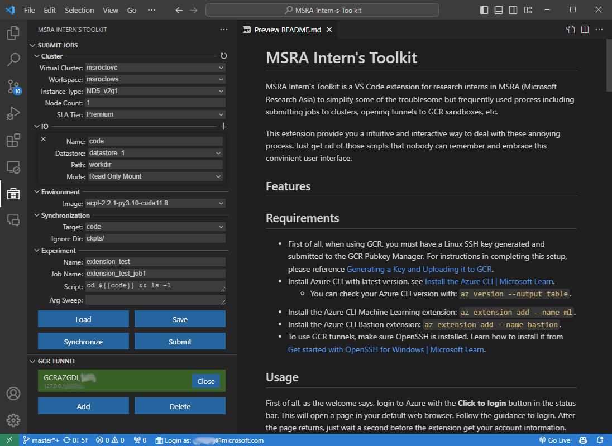

# MSRA Intern's Toolkit

MSRA Intern's Toolkit is a VS Code extension for research interns in MSRA (Microsoft Research Asia) to simplify some of the troublesome but frequently used process including submitting jobs to clusters, privileged identity management (PIM) for Azure, opening tunnels to GCR sandboxes, etc.

This extension provide you a intuitive and interactive way to deal with these annoying process. Just get rid of those scripts that nobody can remember and embrace this convinient user interface.

## Screenshots



## Requirements
* First of all, when using GCR. you must have a Linux SSH key generated and submitted to the GCR Pubkey Manager. For instructions in completing this setup, please reference [Generating a Key and Uploading it to GCR](https://dev.azure.com/msresearch/GCR/_wiki/wikis/GCR.wiki/4099/SSH-Key-Management).
* Install Azure CLI with latest version. see [Install the Azure CLI | Microsoft Learn](https://learn.microsoft.com/en-us/cli/azure/install-azure-cli).
  * You can check your Azure CLI version with: `az version --output table`.
* Install the Azure CLI Machine Learning extension: `az extension add --name ml`.
* Install the Azure CLI Bastion extension: `az extension add --name bastion`.
* To use GCR tunnels, make sure OpenSSH is installed. Learn how to install it from [Get started with OpenSSH for Windows | Microsoft Learn](https://learn.microsoft.com/en-us/windows-server/administration/openssh/openssh_install_firstuse?tabs=gui).

## Usage

First of all, as the welcome says, login to Azure with the **Click to login** button in the status bar. This will open a page in your default web browser. Follow the guidance to login. After the page returns, just wait a second before the extension get your account information. Then you can get access to the tools.

**Quick Jump:**

* [Multiple Profiles](#multiple-profiles)
* [Submit Jobs](#submit-jobs)
* [Privileged Identity Management (PIM)](#privileged-identity-management-pim)
* [GCR Tunnel](#gcr-tunnel)
* [Quick Command](#quick-command)

### Multiple Profiles

Under some circumstances, you may need different accounts for different modules. For example, you may need corporation account for GCR tunnel and SC-Alt account for Azure ML. This tool provides a way to login and switch between multiple accounts.

* **Login:** Click the **Click to login** button in the status bar to login. This will show a list of your profiles. Profiles are where your account information is stored. They have an arbitrary name. Buttons on the right of each profile are for `login`, `logout`, `edit`, `open terminal` and `delete`. Note that, If you want to use `az` command for a specific profile in the terminal, you must open the terminal with the profile.
* **Switch:** For each module, you can choose the profile to use. The profile you choose will be used for the module. If you haven't logged in, you will be asked to login first. If you have multiple profiles, you can switch between them by clicking the button on the right of the module name.

### Submit Jobs

* Azure ML Jobs work with **Clusters**, **Datastores** and **Environments**:
  * **Clusters** are the computing resources where your job will run. You can choose the number and type of GPUs/CPUs with **Instance Type** and **Node Count**.
  * **Datastores** are the blob container where your data and code are stored. Jobs will access the data and code from the specified **Datastore**.
  * **Environments** are the software environment where your job will run. This tool only supports choosing from curated images. You can run a setup script before the experiment to install required packages.
* Fill the form following the [guidance](#about-the-submission-config) and press **Submit** to submit the job. If everything is ok, you shall get a success message with job id and AML Studio link after a while. If not, you will get an error message. You can check the error message in the output panel.
* Submission history is saved. You can also save the submission config to a file and load it later with **Save** and **Load** buttons.
* To synchronize the code from local working directory to the blob container, configure **Synchronization** group and press **Synchronize** button. This will copy the code to the specified path on the blob container.

#### About the submission config:

**Cluster**

Cluster zone sets which virtual cluster and workspace to submit the job, how many nodes and gpus per nodes to use and priority.

* **Virtual Cluster:** The detailed information of each virtual cluster can be found in the dropdown list, including available GPU types and numbers. Choose the one that fits your job best.
* **Workspace:** The workspace where you can monitor and manage your jobs. Some of the virtual clusters may have default workspaces. By selecting a virtual cluster, the workspace will be automatically set. If not, you can choose one from the dropdown list.
* **Instance Type:** GPU type and numbers are set by **Instance Type**, which is a name string alike `ND40_v2g1`. The discription of each instance type can be found in the dropdown list.
* **Node Count:** Set the number of nodes. If you want to run a distributed job, set the node count to larger than 1. The submitter will launch one process per node with environs `NODE_RANK`, `MASTER_ADDR` and `MASTER_PORT`. You can use these values to launch distributed training inside your scipt.
* **SLA Tier:** Determines the priority of your job. The higher the tier, the less likely your job getting interrupted.


For more information about virtual clusters, referring to [Singularity Overview - Overview](https://dev.azure.com/msresearch/GCR/_wiki/wikis/GCR.wiki/4712/Singularity-Overview).

**IO**

IO zone sets the datastores and paths your job can access. Multiple datastores can be added. Press **+** button on the top right corner to add a new IO configuration. Press **x** button on the top left corner of each IO configuration to remove it. The configuration includes:

* **Name:** Arbitrary name for the IO, the job script will use `${{name}}` as the reference to this IO.
* **Datastore:** Name of the datastore to access. The datastores can be found in the dropdown list. A **Manage Datastore** button is provided in the dropdown list to manage the datastores. Note that when submitting the job, the tool will always try to create a new datastore in the workspace with the name provided. To avoid creating multiple datastores with the same blob container and reuse the existing one, replace the random string with the name of existing datastore when adding a new datastore with **Manage Datastore** button.
* **Path:** Path of the IO on the datastore (blob container).
* **Mode:** The mode of the IO.
  * **Read Only Mount:** Mount the IO to the node in read-only mode. 
  * **Read Write Mount:** Mount the IO to the node in read-write mode.
  * **Download:** Download the IO to the node before running the job.
  * **Upload:** Upload the IO to the datastore after the job finishes.

**Environment**

* **Image:** Image name of the environment. Now only curated images are supported. See [Singularity container images - Singularity](https://singularitydocs.azurewebsites.net/docs/container_images/).

**Synchorization**

* **Target:** The target IO to sync the local working directory to. The target IO should be added in the **IO** zone before using it here.
* **Ignore Dir:** Directories to be ignored when syncing. Use ';' to seperate multiple directories.

**Experiment**

* **Name:** Arbitrary name for your experiment.
* **Job Name:** Arbitrary name for your job. This will be shown in the job list.
* **Scipt:** Script to run. The script will be uploaded to cluster and run. You can use `${{io_name}}` to refer to the IOs and `${{arg_name}}` to refer to the arguments in the **Arg Sweep**.
* 
    **Arg Sweep:** Arguments to sweep.
    
    The format is key-value pairs. Each key-value pair is in the format of `arg_name:arg_value1[sep]arg_value2...` or `(arg1_name,arg2_name...):(arg1_value1,arg2_value1...)[sep](arg1_value2,arg2_value2...)...`. The separator `[sep]` can be `,` or `\n`.
    
    The submitter will generate a job for each combination of different key-value pairs and replace the corresponding placeholder `${{arg_name}}` in the script and job name. For example, the following arg sweep will generate 4 jobs (indentation is for better reading, not required):
    ```
    (lr_G, lr_D):
        (1e-4, 1e-4)
        (1e-5, 1e-5)
    batch_size: 32, 64
    ```
    equals to:
    ```
    (lr_G, lr_D, batch_size):
        (1e-4, 1e-4, 32)
        (1e-4, 1e-4, 64)
        (1e-5, 1e-5, 32)
        (1e-5, 1e-5, 64)
    ```
    If you are dealing with continuous integer arguments, you can use `start-end` to represent a range. For example, `id: 0, 2-4` is equivalent to `id: 0, 2, 3, 4`. 
    
    To avoid parsing if your argument value contains aforementioned separator, use `'` or `"` to wrap the value. For example, `arg: 'value1,value2'` or `arg: "value1,value2"`.


### Privileged Identity Management (PIM)

For security reasons, you may need to use a privileged identity to access some resources. This tool provides a way to request a privileged identity and keep it alive automatically.

* Press **Refresh** button in the top right corner to refresh the list of roles.
* Press **Activate** button to activate a role.
* Press **Deactivate** button to deactivate a role.
* To keep the identity alive, check the **Watch** icon on the right of the role. The tool will automatically reactivate the role when it expires.
  
### GCR Tunnel

Only available under local Windows and Mac machine.
* Press **Add** button to setup a new tunnel.
* Input sandbox ID and port as guided. Note that:
* * Sandbox ID is the last 4 digits of the GCRAZGDL#### host you wish to connect to.
* * Local port of the tunnel, should be 5 digits start with 2.
* After the tunnel is successfully added, press **Open** button and wait for the tunnel to open.
* The tunnel will be opened on `127.0.0.1:yourport` (shown as the second row of tunnel info, below sandbox name). You can directly connect to it using `ssh -p yourport youralias@microsoft.com@127.0.0.1`. But I recommend using VS Code Remote-SSH for productivity. Edit your ssh config and add the following:
```
Host tunnel
    HostName 127.0.0.1
    Port yourport
    User youralias@microsoft.com
    StrictHostKeyChecking=No
    UserKnownHostsFile=\\.\NUL    # or /dev/null for Mac
```

### Quick Command

**Quick Command** helps you run some Azure related command quickly. You can use `ctrl+shift+p` to open the command palette and search for `MSRA Intern's Toolkit: Quick Command` to run the command or just open a Azure CLI terminal. The `QuickCmd` button will be shown in the status bar. Click it to run the command. Currently, the following commands are supported:

* **Generate SAS:** Generate a SAS token for a blob container.
* **Azcopy:** Copy files between local and blob container.

## Troubleshooting

**Azure CLI not installed.**

* Install Azure CLI with latest version. See [Install the Azure CLI | Microsoft Learn](https://learn.microsoft.com/en-us/cli/azure/install-azure-cli).

**Command timeout.**

* Maybe caused by network issue. Check your VPN if you are remote.

### Submit Jobs

**Azure ML extension not installed.**

* Install the Azure CLI Machine Learning extension: `az extension add --name ml`.

**Permission denied.**

* Make sure you have the permission to access the working directory.

### GCR Tunnel

**Azure Bastion extension not installed.**

* Install the Azure CLI Bastion extension: `az extension add --name bastion`.

**SSH tunnel failed.**

* A possible reason is the bad owner or permissions on `.ssh/config` file. Make sure this file is owned by your alias account and no others are permitted to access. Inherit should be disabled. 

## For more information

* [Install the Azure CLI | Microsoft Learn](https://learn.microsoft.com/en-us/cli/azure/install-azure-cli).
* [Get started with OpenSSH for Windows | Microsoft Learn](https://learn.microsoft.com/en-us/windows-server/administration/openssh/openssh_install_firstuse?tabs=gui)
* [GCR Bastion - Overview](https://dev.azure.com/msresearch/GCR/_wiki/wikis/GCR.wiki/6627/GCR-Bastion)
* [SSH Key Management - Overview](https://dev.azure.com/msresearch/GCR/_wiki/wikis/GCR.wiki/4099/SSH-Key-Management)
* [Singularity Overview - Overview](https://dev.azure.com/msresearch/GCR/_wiki/wikis/GCR.wiki/4712/Singularity-Overview)
* [Linux Sandbox Getting Started - Overview](https://dev.azure.com/msresearch/GCR/_wiki/wikis/GCR.wiki/531/Linux-Sandbox-Getting-Started)

**Enjoy!**
